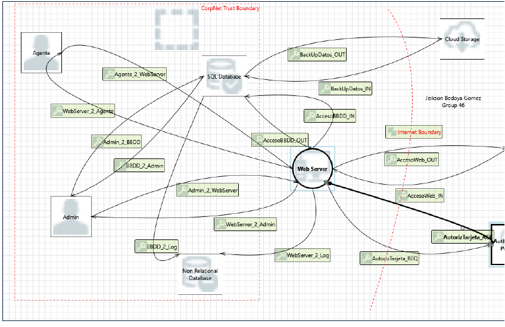
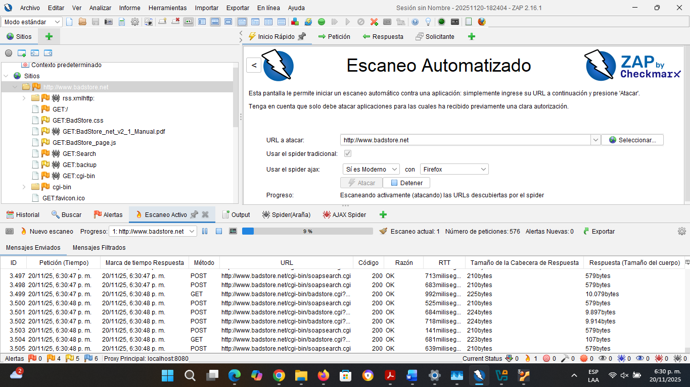

# 🔐 Análisis de Amenazas y Evaluación de Vulnerabilidades

## Descripción

Proyecto académico enfocado en la identificación de riesgos de seguridad y vulnerabilidades mediante técnicas de Threat Modeling y pruebas de seguridad sobre aplicaciones web.

El proyecto se desarrolló en dos fases. La primera consistió en el análisis de amenazas utilizando la metodología STRIDE sobre un modelo de flujo de datos (DFD), permitiendo identificar riesgos potenciales y definir controles de mitigación. La segunda fase consistió en el despliegue de una aplicación vulnerable en un entorno controlado y la ejecución de pruebas de seguridad utilizando OWASP ZAP.

El objetivo fue comprender cómo identificar amenazas, evaluar riesgos y proponer medidas de protección orientadas a fortalecer la seguridad de aplicaciones y sistemas.

---

## Objetivos

- Modelar una aplicación mediante un Diagrama de Flujo de Datos (DFD).
- Identificar amenazas utilizando la metodología STRIDE.
- Evaluar riesgos y proponer salvaguardas para reducir su impacto.
- Realizar pruebas de seguridad sobre aplicaciones web.
- Analizar vulnerabilidades y plantear medidas de mitigación.

---

## Herramientas y Tecnologías Utilizadas

- Microsoft Threat Modeling Tool
- OWASP ZAP
- Oracle VirtualBox
- BadStore Web Application
- STRIDE
- Análisis de Riesgos

---

# Fase 1: Modelado de Amenazas

## Diagrama de Flujo de Datos (DFD)

Se elaboró un Diagrama de Flujo de Datos para identificar procesos, entidades externas, almacenes de datos y flujos de información dentro de la aplicación analizada.

---

## Análisis de Amenazas

Se utilizó la metodología STRIDE para identificar posibles amenazas que podrían afectar la confidencialidad, integridad y disponibilidad de la información.

### Amenazas Identificadas

| Amenaza | Riesgo |
|----------|---------|
| Debilidad en la autorización SSO | 42 |
| Suplantación de la entidad administrativa externa | 42 |
| Corrupción de base de datos no relacional | 30 |
| Negación de recepción de datos por parte del proveedor de autorización | 12 |
| Ejecución remota de código en servidor web | 48 |

---

## Medidas de Mitigación Propuestas

| Amenaza | Mitigación Principal |
|----------|---------------------|
| Debilidad en SSO | OAuth2 + PKCE, OpenID Connect y TLS |
| Suplantación de entidad administrativa | mTLS, autenticación mediante certificados y control de acceso |
| Corrupción de base de datos | Validación de datos y monitoreo de anomalías |
| Negación de recepción de datos | Auditoría, registros y confirmaciones firmadas |
| Ejecución remota de código | Validación de entradas, mínimo privilegio y actualización continua |

---

## Evaluación de Riesgos

Las amenazas identificadas fueron evaluadas considerando probabilidad de ocurrencia e impacto potencial, permitiendo priorizar aquellas con mayor nivel de riesgo.

| Riesgo Identificado | Valor |
|--------------------|--------|
| Ejecución remota de código (RCE) | 48 |
| Debilidad en autorización SSO | 42 |
| Suplantación de entidad administrativa | 42 |
| Corrupción de base de datos | 30 |
| Negación de recepción de datos | 12 |

---

# Fase 2: Evaluación de Vulnerabilidades

## Entorno de Pruebas

Se desplegó la aplicación vulnerable **BadStore** en una máquina virtual utilizando Oracle VirtualBox con el fin de realizar pruebas de seguridad en un entorno controlado.

---

## Escaneo con OWASP ZAP

Se realizó un análisis de seguridad mediante OWASP ZAP, identificando vulnerabilidades presentes en la aplicación web.

---

## Vulnerabilidades Identificadas

### SQL Injection

OWASP ZAP identificó una vulnerabilidad de inyección SQL en un formulario de la aplicación. Se comprobó manualmente mediante el envío de entradas maliciosas que generaban errores de sintaxis SQL.

**Impacto:**
- Acceso no autorizado a datos.
- Manipulación de información.
- Compromiso de la base de datos.

**Mitigación:**
- Uso de consultas parametrizadas.
- Procedimientos almacenados.
- Validación de entradas.
- Ocultamiento de mensajes de error SQL.

---

### Ausencia de Anti-CSRF Tokens

Se detectó la ausencia de mecanismos de protección contra ataques Cross-Site Request Forgery (CSRF), permitiendo que solicitudes maliciosas puedan ejecutarse utilizando sesiones activas de usuarios legítimos.

**Impacto:**
- Ejecución de acciones no autorizadas.
- Manipulación de cuentas de usuario.

**Mitigación:**
- Implementación de Anti-CSRF Tokens.
- Validación de solicitudes.
- Protección complementaria frente a ataques XSS.

---

### Content Security Policy (CSP) No Configurada

Se identificó la ausencia de la cabecera Content-Security-Policy (CSP), permitiendo la carga de recursos sin restricciones desde múltiples orígenes.

**Impacto:**
- Mayor exposición a ataques de inyección de contenido.
- Riesgo de ejecución de scripts maliciosos.

**Mitigación:**
- Configuración de cabeceras CSP.
- Restricción de scripts, estilos e imágenes a fuentes confiables.

---

# Principales Hallazgos

- Identificación de amenazas mediante STRIDE y análisis de riesgos.
- Evaluación de vulnerabilidades web utilizando OWASP ZAP.
- Comprensión de riesgos relacionados con autenticación, integridad de datos y ejecución remota de código.
- Aplicación de controles de mitigación basados en buenas prácticas de seguridad.

---

# Contenido del Repositorio

- `/images` → Diagramas y capturas de la implementación.
- `/reports` → Reportes generados durante las pruebas de seguridad.
- Evidencias del modelado de amenazas.
- Resultados del análisis de vulnerabilidades.
- Medidas de mitigación propuestas.

---

# Resultados Obtenidos

- Aplicación práctica de la metodología STRIDE.
- Comprensión del proceso de identificación y análisis de amenazas.
- Uso de herramientas de evaluación de seguridad.
- Interpretación de resultados de escaneo de vulnerabilidades.
- Definición de controles para reducir riesgos de seguridad.
- Fortalecimiento de conocimientos en análisis de seguridad informática.

---

## Autor

**Jeikson Bedoya Gómez**

Proyecto desarrollado como parte de la formación en Ingeniería de Sistemas.
